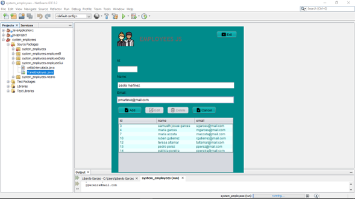
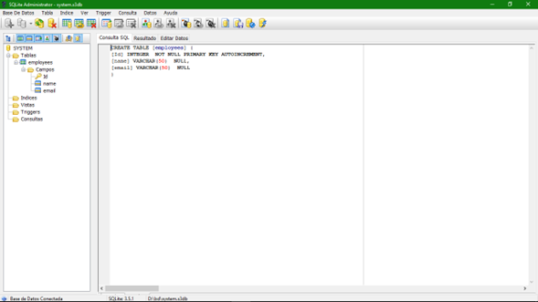

# project-java
 
<h2 style= color:"#008080">CRUD java whit BD Sqlite Admin and IDLE Netbeans.</h2>
 
$\ Graphic Interface$
<h3 color[rgb]{1,0,1}>Graphic Interface</h3> 
 

 
<h3 color="RED">Database SQLITE ADMIN</h3>
 

 
